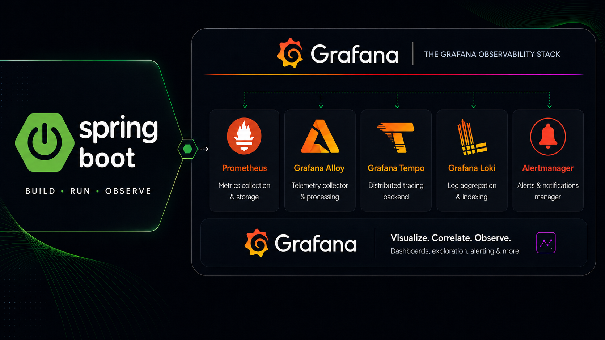

# Spring Boot Microservices Observability



This project is a Spring Boot microservices demo that combines business services with a full Grafana-based observability stack. It shows how to run distributed services with centralized metrics, logs, traces, dashboards, and alerting by using Docker Compose, Spring Cloud, Prometheus, Loki, Tempo, Grafana, and Grafana Alloy.

## What This Project Includes

- Spring Boot microservices for customer, product, order, and payment flows
- Spring Cloud Config Server for centralized configuration
- Eureka Discovery Server for service registration and discovery
- Spring Cloud Gateway as the single API entry point
- PostgreSQL and MongoDB for service data storage
- Prometheus for metrics scraping
- Loki for centralized log collection
- Tempo for distributed tracing
- Grafana Alloy for OTLP trace ingestion and Docker log forwarding
- Grafana with pre-provisioned datasources and dashboards
- Alertmanager for Prometheus alert routing

## Tools and Services

### Application Services

- `config-server`  
  Centralizes configuration for all Spring Boot services.

- `discovery-service`  
  Acts as the Eureka registry so services can find each other dynamically.

- `gateway-service`  
  Exposes one entry point for the APIs and routes requests to downstream services.

- `customer-service`  
  Manages customer data stored in MongoDB.

- `product-service`  
  Manages the product catalog and inventory in PostgreSQL.

- `order-service`  
  Handles order creation and coordinates calls to customer, product, and payment services.

- `payment-service`  
  Processes payment requests and stores payment data in PostgreSQL.

### Databases and Admin Tools

- `postgresql`  
  Main relational database used by product, order, and payment services.

- `pgadmin`  
  Web UI for exploring PostgreSQL data.

- `mongodb`  
  NoSQL database used by the customer service.

- `mongo-express`  
  Web UI for browsing MongoDB collections.

### Observability Stack

- `prometheus`  
  Scrapes Spring Boot Actuator metrics from the services.

- `grafana`  
  Visualizes metrics, logs, and traces through ready-to-use dashboards.

- `loki`  
  Stores logs collected from Docker containers.

- `tempo`  
  Stores distributed traces exported by the services.

- `alloy`  
  Receives OTLP traces from the applications and forwards Docker logs to Loki.

- `alertmanager`  
  Receives alerts triggered by Prometheus rules.

## API Entry Point

All business APIs are exposed through the gateway on `http://localhost:8333`.

- Customers: `http://localhost:8333/api/v1/customers`
- Products: `http://localhost:8333/api/v1/products`
- Orders: `http://localhost:8333/api/v1/orders`
- Payments: `http://localhost:8333/api/v1/payments`

## How to Run

### Prerequisites

- Docker Desktop or Docker Engine
- Docker Compose

### Start Everything

```bash
docker compose up --build -d
```

The first startup can take a few minutes because Docker needs to build the Spring Boot services.

### Useful URLs

- Gateway API: [http://localhost:8333](http://localhost:8333)
- Config Server: [http://localhost:8888](http://localhost:8888)
- Eureka Discovery: [http://localhost:8761](http://localhost:8761)
- Grafana: [http://localhost:3000](http://localhost:3000)
- Prometheus: [http://localhost:9090](http://localhost:9090)
- Alertmanager: [http://localhost:9093](http://localhost:9093)
- Tempo API: [http://localhost:3200](http://localhost:3200)
- Loki API: [http://localhost:3100](http://localhost:3100)
- pgAdmin: [http://localhost:5050](http://localhost:5050)
- Mongo Express: [http://localhost:8081](http://localhost:8081)

### Grafana Login

- Username: `admin`
- Password: `admin`

### Stop Everything

```bash
docker compose down
```

## Observability Features

- Prometheus metrics from Spring Boot Actuator endpoints
- OpenTelemetry trace export from the services
- Centralized container logs in Loki
- Distributed traces stored in Tempo
- Pre-provisioned Grafana datasources
- Preloaded dashboards for metrics, traces, logs, and business KPIs
- Prometheus alert rules connected to Alertmanager
